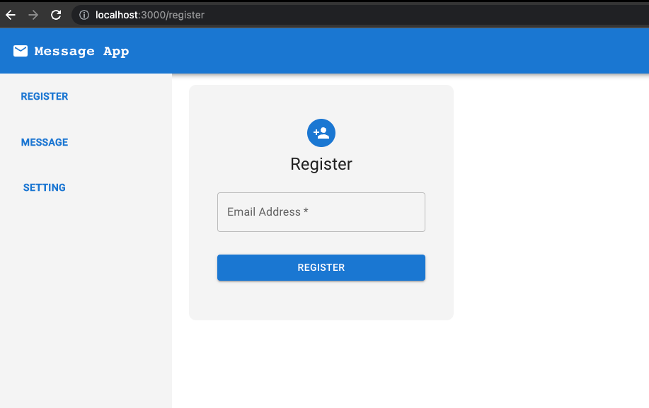
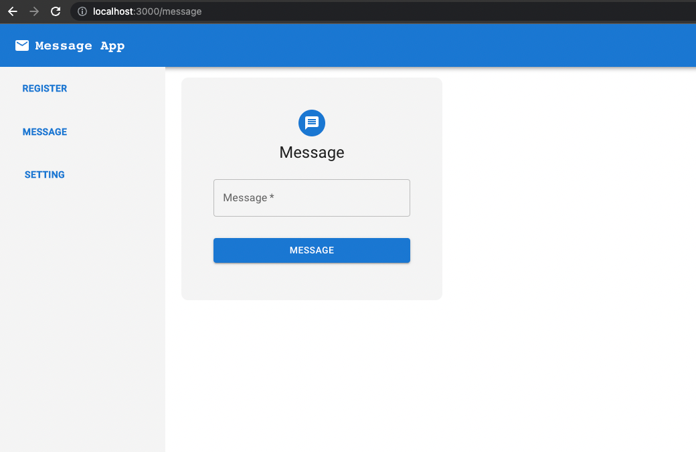
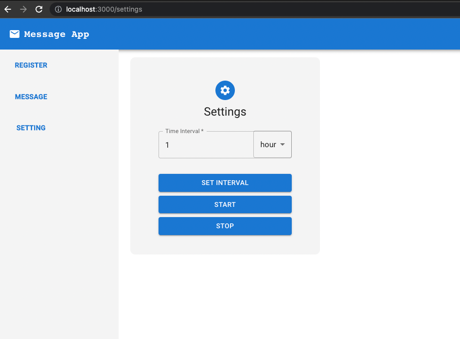

# Assignment Cope Notes Overview

This app consists of Express server Restful API, File Database, and a client written in ReactJS.
App is made as a monorepo, this single repo consists of server, database, and client application.

## Server
Server API consists of routes:
- `/` - root
- `/messages` - to register messages
- `/users` - to register users (email)

All the sub routes have comments mentioning the use case of the endpoints.

## Database
Database consists of 4 files(tables) in server/database/*
- **Configs**: stores the configurations of application i.e. interval of messages
- **Message**: stores the messages that will be sent to users
- **User**: stores the users who will be sent messages
- **UserMessage**: stores the messages that were sent to users.
  
### Database models: 
Database models are in `server/models/*`

## Client
Client app is written in ReactJS

Client app is bootstrapped using Create-React-App and Material UI.

App is integrated with Restful API. 

Pages of the apps are listed below
- [Register](http://localhost:3000/register) page, Registers a user


- [Message](http://localhost:3000/message) page, to save a message

  
- [Settings](http://localhost:3000/settings) page 
- To update the interval of message worker
- To start the message worker
- To stop the message worker


## Installation and running

I've configured Docker compose for development purpose.
App can be run both with and without docker.

- First Install the dependencies in the root of the repo.
```
yarn install
```
or using npm
```
npm install
```
  
- Run the app without docker
  - To start the api in development mode
  ```
   yarn dev
  ```

  - To start the api in development mode
  ```
  yarn start
  ```
  
- Run with docker and docker compose
Uses docker-compose.yml in root, and Dockerfile in server/ and client/
```
docker compose up
```

Server API runs on port [4000](http://localhost:4000)

Client app runs on port [3000](http://localhost:3000)

## Further improvements
Further improvements that can be made,
- Write separate READMEs in both server/ and client/
- Setup production builds in Dockerfile for Client application.
- Utilise Typescript.
- Move the Messages worker to a separate service, that should run independently
- Deploy these apps to Heroku to give a better experience.
- Move all the server logs to a _logs/ directory
- Write test cases for critical use cases specially the messages worker.
